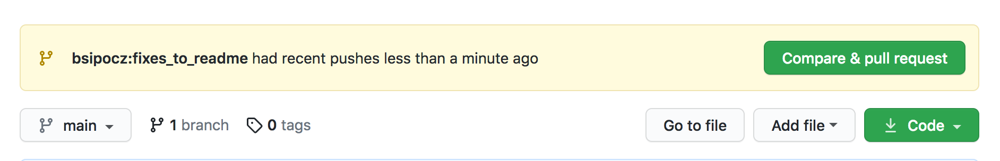
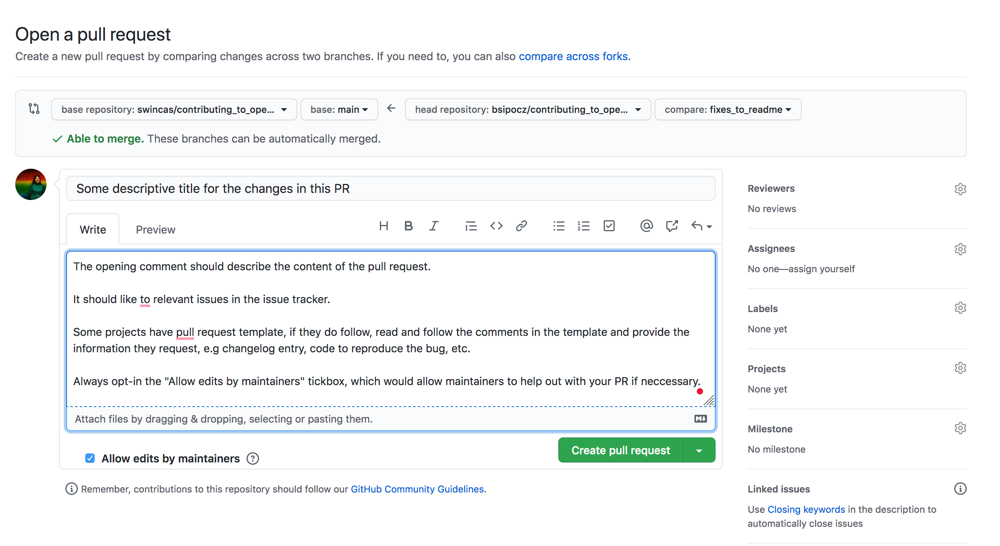

# Pull Requests and Reviewing Code

### Background

A very useful skill in both astronomy and the wider software world to be able to make contributions
to software repositories using *pull requests* (PRs). (This is what they are called on GitHub - they go by
other similar names in other places - e.g. *merge requests* on GitLab).  This is useful whether you
are working as part of a collaboration that is using git repositories for common code, or if you want
to contribute to an open code base that is being developed in a git repository.

There are two main benefits to making contributions via pull requests:

* It allows other people to review the changes you are requesting and make their own suggestions on
 your code before they are merged (i.e. before they are incorporated into the main repository).
* It allows anyone to contribute by proposing changes to any repository without taking on the risk of
 many people having write-access to the main repository.

In this tutorial, we will go through the process of opening a pull request, and we will also take some
time to review each other's pull requests. We will take the example of a repository on GitHub,
but note that the workflow will be similar for other platforms such as GitLab and BitBucket.

### Workflow guidelines

For further read about open source contributing workflows see any of the following:

* [crash course in contributing to open source](https://sites.google.com/view/nyc-2020-scikit-sprint) material presented at a scikit-learn sprint,
* [contributing to NumPy](https://numpy.org/contribute/) with [guides for code contributions](https://numpy.org/devdocs/dev/index.html#development-process-summary)
* ["contributing to pandas" (pandas docs)](https://pandas.pydata.org/docs/dev/development/contributing.html)
* [Developer and Contributor Guides as Scientific Python](https://learn.scientific-python.org/)).
* ["How to create a Minimal, Reproducible Example" (Stack Overflow docs)](https://stackoverflow.com/help/minimal-reproducible-example)
* ["Why should I not upload images of code/data/errors?" (Meta Stack Overflow)](https://meta.stackoverflow.com/questions/285551/why-should-i-not-upload-images-of-code-data-errors)


## Problem 1: Making some changes and opening a pull request


### 1a: Fork the repository

The repository we will be opening pull requests to is at https://github.com/scipy-conference/scipy2024_sprints_first_PR .
Since you don't have write access to this repository, the first step will be to make a "fork" of the repository.
This is basically a copy of the main repository, but one that you have complete control to modify as you see fit
(and that is visible to everyone else on GitHub).  Make sure you are logged in to GitHub, then go to the
repository and click the 'Fork' button:


This will create a copy of the repository at ``https://github.com/<username>/scipy2024_sprints_first_PR``
where ``<username>`` is your GitHub username.

### 1b: Clone your fork

Now that you have forked your repository, you can clone it to your computer.

You can use HTTPS:

    git clone -o <username> https://github.com/<username>/scipy2024_sprints_first_PR

GitHub has turned off password authentication, so you will need to set up token access for HTTPS.
Follow these [instructions](https://docs.github.com/en/authentication/keeping-your-account-and-data-secure/creating-a-personal-access-token#creating-a-personal-access-token-classic) to generate a token, and then use it in place of your password.

You can also authenticate with ssh (follow the [instructions](https://docs.github.com/en/authentication/connecting-to-github-with-ssh) ).
If you use GitHub a lot, enabling 2-factor authentication and ssh is a good idea (it also means
you won't have to type your user name and password every time).

With ssh set up, you can use:

    git clone -o <username> git@github.com:<username>/scipy2024_sprints_first_PR

Be sure to replace ``<username>`` with your GitHub username in both cases!

### 1c: Familiarize yourself with the code

Once the repository has been cloned, ``cd`` into it and check what files are available:

    cd scipy2024_sprints_first_PR
    ls

Under ``participants`` you should see a set of directories, with one directory per participant. Please comment on the conference Slack channel, 
#bof-scipy-2024-sprint-prep-bof, to claim a directory to let others know to work in another one to avoid conflicts. 

    cd participants/scipy_000

You should now see the following files:

* ``doc/README.md``: basic documentation for some of the code

* ``pr_tutorial/simple_functions.py``: a set of simple functions that should work properly

* ``pr_tutorial/buggy_function.py``: a function that contains one or more bugs

* ``pr_tutorial/tests/``: tests intended to confirm the functions are working as expected

* ``setup.py``: configuration to package those functions as a Python library

Take a look at these files, and familiarize yourself with the contents.

### 1d: Make a new branch

By default, you will be looking at the ``main`` "branch" of the repository. You're going to make some
changes to the code, but who knows... maybe the reviewers will spend so long reviewing your changes
that you want to do another set of unrelated changes in the mean time. Thus it's always best to make
changes in a dedicated branch. So before you make any changes, make a new branch with:

    git branch <name-of-branch>

You can then switch to this branch with:

    git checkout <name-of-branch>

Note that you can also write ``git checkout -b <name-of-branch>`` as a short-hand for the above two
commands. Branch names should be kept simple and reasonably short, and can't include e.g. spaces.

### 1e: Make some changes

At this point, you can pick what kind of changes you would like to make - and we've provided three
different types of changes depending on what you are mos. You can choose to tackle more than one of
 these if you like, but since we are limited in time, the aim is to just do one of these:

* As you've probably noticed, the documentation in ``README.md`` is... not great. Try and edit it to
 make it more readable! You can edit the text, and choose to add more examples if you like (and potentially
 fix the existing ones).

* Add a new function in ``simple_functions.py`` called ``is_prime`` that takes an integer number and
 returns ``True`` if the number is prime, and ``False`` if not.

* Try and find the bug(s) in the ``buggy_function.py`` file and fix them.

Once you've done at least one of these, you can move to the next step!

### 1f: Test your package

 * you can install your ``pr_review`` package with:

       pip install .

 * For running the formal tests, the testing library ``pytest`` is need to be installed. Once it is available run the tests with:

       pytest pr_tutorial

 It will produce an output like the following:

```
================================================= test session starts ==================================================
platform darwin -- Python 3.11.0, pytest-7.2.1, pluggy-1.0.0
rootdir: /Users/bsipocz/munka/devel/scipy2024/scipy2024_sprints_first_PR/participants/scipy_000
plugins: remotedata-0.4.0, rerunfailures-10.3, nbval-0.10.0, doctestplus-0.13.0, hypothesis-6.58.1, mock-3.10.0, dependency-0.5.1, filter-subpackage-0.1.2, requests-mock-1.10.0, astropy-header-0.2.2, astropy-0.10.0, cov-4.0.0, openfiles-0.5.0, anyio-3.6.2, arraydiff-0.5.0
collected 1 item

pr_tutorial/tests/test_simple_function.py .                                                                      [100%]

================================================== 1 passed in 0.01s ===================================================
```

 * If all tests pass, and you are happy with the test coverage go to the next step and commit the changes. Otherwise you can add more tests (e.g. add a test that covers the buggy functionality.

### 1g: Commit the changes and push it to your fork

Now that you've made changes, the next step is to commit these changes to the repository. You can see
what files have changed since the last commit with:

    git status

We now need to 'stage' files before committing them - the difference between staging and committing
files is that staging consists of selecting which files you will want to commit changes for (you may
want to separate the commits for changes to different files for some reason). To stage files, use
the ``git add`` command as:

    git add file-to-stage

and repeat this for each file you want to include in the next commit. You can use ``git status``
to check which files have been staged for committing. Once you are happy with the files that have been
staged, you can create a commit in the repository using:

    git commit -m "Message describing the changes here"

Be sure to edit the commit message to be descriptive, so that anyone looking at the git history has
an idea of roughly what each commit does.

**Good commit message:** ``Fixed bug in this_function which was due to an off-by-one error``

**Bad commit message:** ``Fixed stuff. It's Friday evening and I want to go home now``

You can now check that your commit is in the history using:

    git log

If the commit is there, you are now ready to push your changes to GitHub! You can do this using:

    git push <username> <name-of-branch>

If this succeeds, you are ready for the next step. If you get an error about the changes being rejected,
ask your friendly instructors!

### 1h: Open a pull request

At this point, go to your fork on GitHub at ``https://github.com/<username>/scipy2024_sprints_first_PR``, and
you should see a yellow-ish banner that looks like this:



Click on **Compare & pull request**. You will then see a screen like:



At this point, give your pull request a sensible title, and use the description box to describe what
changes you've made, why you made them, and you can also mention if there are any unresolved issues for
 example. You can also preview the changes by scrolling down on the page.

If for some reason you don't see the yellow banner (for example, if you went and did something else
after pushing so that it timed out), you can also make a pull request by choosing your branch from the
drop-down menu and then choosing 'New pull request'

Once ready, hit **Create pull request**, and you're done!


## Problem 2: Reviewing someone else's pull request

Once you've opened a pull request, take a look at what other pull requests have been opened and find
one other than yours, and leave a comment to indicate that you would like to review it (a short message
like 'I am going to review this' is fine). If possible try and pick one that no one else has offered to
review yet, but if needed you can review one that is already being reviewed by someone else.

To review a pull request, first take a look at the description for the pull request, then go to the
**Files changed** tab. Here you will see the line by line changes from the pull request If you like,
you can leave in-line comments by hovering over the left of the lines by clicking on the blue **+**:


At this point, you can make a comment then click **Start a review**. If you add more comments, you
will need to click on **Add to review**. Once you've finished adding comments, you can click on
**Finish your review** in the top right above the detailed changes, and leave a general message and
your recommendation (approve or request changes).

But what should you comment on? Anything you think can be improved or that you don't understand! For example:

* You can ask for comments to be added to code that's not intuitive
* You can comment on the coding style
* You can point out mistakes/bugs
* You can suggest additions to the code using the 'Insert a suggestion' option in the GitHub interface

In general make sure you comment constructively (and maybe even friendly)! You can also choose to
leave comments that don't require changes, e.g. 'Nice approach!'. If a pull request is perfect, you
can just skip adding in-line comments and just leave a general comment and approve the pull request.
In general you have the choice to approve or ask for revision - while in a repo like this where you
don't have write access, these are not binding, but they are critical signals to the actual maintainers
whether you feel the code is ready to be accepted or not.  If you don't feel ready to say something
firm either way you can always just leave your review as a comment, which serves to neither ask for
changes nor accept the pull request.

## Problem 3: Making additional changes

If someone comments on your pull request and you decide to follow their recommendations, you can add
new changes to the pull request without having to open a new one. To do this, just make any changes
you need, then stage the files to change with ``git add`` as described above, then commit the changes
with ``git commit`` and use ``git push`` to push the changes to your branch. The commit will then
appear in the pull request. Once you think it's all ready, you might want to ask one of the instructors
if they are willing to merge your PR.


## Dealing with changes in the primary repository

If you are opening a pull request on a busy repository such as the core astropy repository, someone
may make improvements to the code after you have opened it, and you may need to rely on their changes.
If this happens, you can use ``git remote`` to add the main repository as a source you can get changes from:

    git remote add bsipocz https://github.com/bsipocz/scipy2024_sprints_first_PR

You only need to do this once for a given local repository.

Once you added the remote, you can do:

    git fetch bsipocz

to fetch the latest changes from the main repository. Note that this won't update your code - to do
this, make sure all your changes are committed, and then use:

    git rebase bsipocz/main

Provided that there are no changes in the main repository that conflict, you should then be good to
go and your local branch will contain both the latest changes from the main repository, and your local
changes. If you previously pushed your branch to GitHub, you will then need to make sure you push
using the ``--force`` flag:

    git push --force <username> <name-of-branch>

If there are conflicts, you can take a look at [this GitHub guide](https://help.github.com/en/articles/resolving-a-merge-conflict-using-the-command-line) on how to resolve them.

Tip: I find the following tutorial extremely useful to practice various git scenarios:
https://learngitbranching.js.org/


### License
Developed for Scipy 2023&2024 by Brigitta Sipőcz &copy; licensed under a
[Creative Commons Attribution 4.0 International License (CC BY 4.0)](https://creativecommons.org/licenses/by/4.0/)

Based on earlier versions for
Scipy Sprints by Jonathan Rocher BSD and multiple iterations of the AstroHackWeek workshop.
